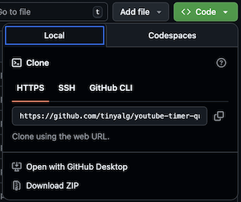

# Chrome拡張機能で学ぶ「エンジニアの思考法」サンプルコード

Zennで公開中の技術書『**Chrome拡張機能で学ぶ「エンジニアの思考法」—— YouTubeタイマー「制作クエスト」**』の公式サンプルコードリポジトリです。

## 📖 本書について
本書は、単なる「Chrome拡張機能の作り方」の解説にとどまりません。
Manifest V3の制約、OSごとのフォーカス判定の違い、Service Workerの寿命といった「システムのエッジケース」と戦いながら、堅牢なタイマーアプリ（よそ見を許さない厳格なタイマー）を錬成していく「エンジニアの思考プロセス」を体験できるチュートリアルです。

## 🚀 サンプルコードの動かし方

Chromeブラウザーで、各章の完成状態の拡張機能を実際に動かして試すことができます。

### 1. コードを入手し、解凍する
まずは、このリポジトリのコードをお手元のPCに保存し、**Chromeブラウザーが読み込める状態** に準備します。

  1. 本ページの右上にある緑色の「**<> Code**」ボタンをクリックします。

        

  2. メニュー下部の「**Download ZIP**」を選択してダウンロードします。
  3. ダウンロードしたファイルを解凍（展開）します。
     * **Mac / Chromebook の場合：** ファイルをダブルクリックするだけで解凍（展開）されます。
     * **Windows の場合：** ファイルを **右クリック** して「**すべて展開...**」を選択してください。
    
       ※ Windowsで、フォルダのアイコンに「**ファスナー**」がついた状態（ZIP形式）のままでは、次のステップで読み込むことができません。必ず「**展開**」を行ってください。

### 2. Chromeブラウザーに読み込む
  1. Chromeブラウザーで `chrome://extensions/` を開きます。
  2. 右上の「**デベロッパー モード**」をオンにします。
  3. 左上の「**パッケージ化されていない拡張機能を読み込む**」をクリックします。
  4. 本リポジトリ内の動かしたい章のフォルダ（例: `02-manifest-v3-basic-timer`）を選択します。

## 📂 フォルダ構成（各章のコード）

各フォルダは、本編の該当チャプター終了時点でのソースコードを格納しています。
フォルダの先頭番号は、Zennの画面上で表示される章番号とリンクしています。

* `02-manifest-v3-basic-timer/` : 動くタイマーを3分で作る
* `03-popup-history-csv-export/` : 成果を形にする
* `04-options-page-customization/` : 脱・ハードコード
* `05-delta-time-precision/` : なぜ時間はズレるのか？
* `06-sleep-detection-logic/` : 睡眠中の8時間が「労働」に化けるのを防ぐ
* `07-focus-audible-tracking/` : よそ見は許さない
* `08-service-worker-persistence/` : 不死鳥の如く
* `09-i18n-and-final-steps/` : 世界へ飛び立つ

## ⚖️ ライセンス (License)
本リポジトリのソースコードは [BSD 3-Clause License](LICENSE) のもとで公開しています。ライセンスの範囲内で自由にご活用いただけます。
